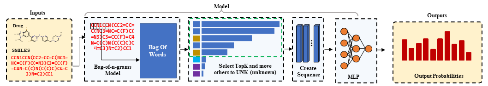

# ***When SMILES have Language*: Drug Classification using Text Classification Methods on Drug SMILES Strings**

Azmine Toushik Wasi, Šerbetar Karlo, Raima Islam, Taki Hasan Rafi, Dong-Kyu Chae

---

## Architecture
<p align="center">
  
</p>

---

## Setup and run
- Data is available at `./Model/_DATA_`
- Dataloader is available at `./Model/data`
- To run the training script, place the dataset from DrugBank, go to `./Model/` folder and run: `python train-ngram.py`
- To change parameters, you can check `145-165` no lines of `./Model/train-ngram.py`

# Experimental Results

| Model          | Accuracy | Precision | Recall | F1 (Weighted) | F1 (Macro) | ROC-AUC |
|----------------|----------|-----------|--------|----------------|-------------|---------|
| 1-gram+MLP     | 0.622    | 0.610     | 0.622  | 0.604          | 0.406       | 0.760   |
| 2-gram+MLP     | 0.669    | 0.700     | 0.669  | 0.672          | 0.445       | 0.810   |
| 3-gram+MLP     | **0.737**| **0.764** | **0.737**| **0.744**     | 0.553       | **0.848**|
| 4-gram+MLP     | 0.726    | 0.758     | 0.726  | 0.731          | 0.524       | 0.841   |
| 5-gram+MLP     | 0.728    | 0.740     | 0.728  | 0.730          | **0.563**   | 0.838   |
| AtomPair+MLP   | 0.799    | 0.804     | 0.800  | 0.799          | 0.702       | 0.876   |
| MACCS+MLP      | 0.797    | 0.801     | 0.797  | 0.796          | 0.702       | 0.873   |
| Morgan+MLP     | **0.800**| **0.804** | **0.800**| **0.799**     | **0.703**   | **0.876**|


# Citation
```
@inproceedings{wasi2024drug_nlp,,
  author       = {Azmine Toushik Wasi and Šerbetar Karlo and Raima Islam and Taki Hasan Rafi and Dong-Kyu Chae},
  title        = {When SMILES have Language: Drug Classification using Text Classification Methods on Drug SMILES Strings},
  booktitle    = {The Second Tiny Papers Track at {ICLR} 2024, Tiny Papers @ {ICLR} 2024, Vienna Austria, May 11, 2024},
  publisher    = {OpenReview.net},
  year         = {2023},
  url          = {https://openreview.net/forum?id=VUYCyH8fCw}
}
```